<h1 align="center">Hi 👋, I'm York</h1>
<h3 align="center">Developer from Taiwan</h3>

    

### About Me

I’m a hobby developer with a passion for building useful, accessible apps. My goal is to create tools that are free of ads, open-source, and genuinely helpful. I believe that even small apps can make a difference if they improve people's daily lives.

#### Links

- [Profile](https://york.qzz.io)

- [York Development](https://york9675.github.io/website/)

---

### Languages and Tools

    
    
    
    
    
    
    

### Operating Systems

    
    
    

### GitHub Stats

### Support

If you find my work helpful and would like to support me, you can buy me a coffee! Your support helps me keep my projects alive and ad-free.

